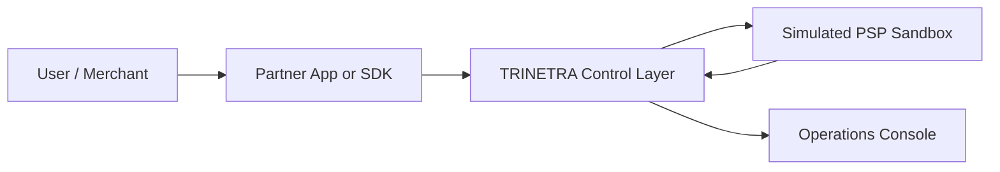
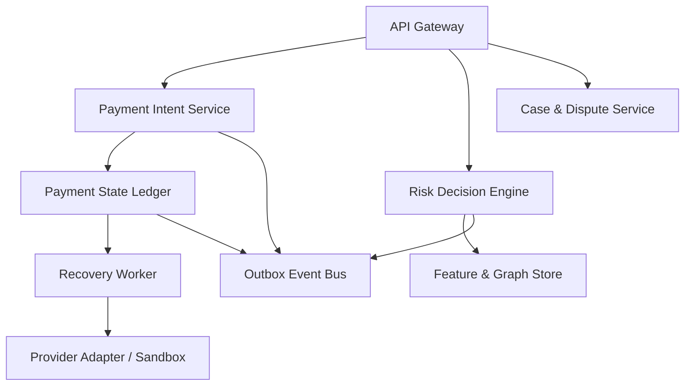
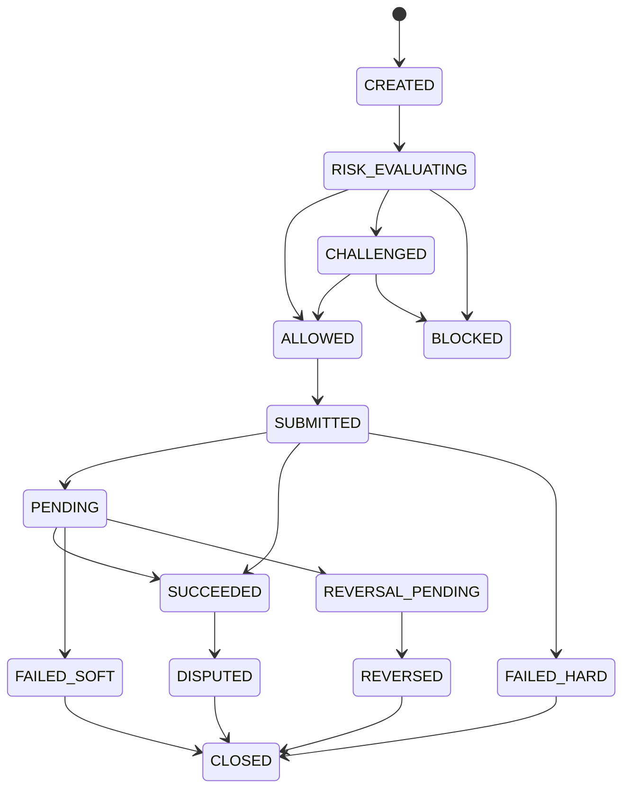
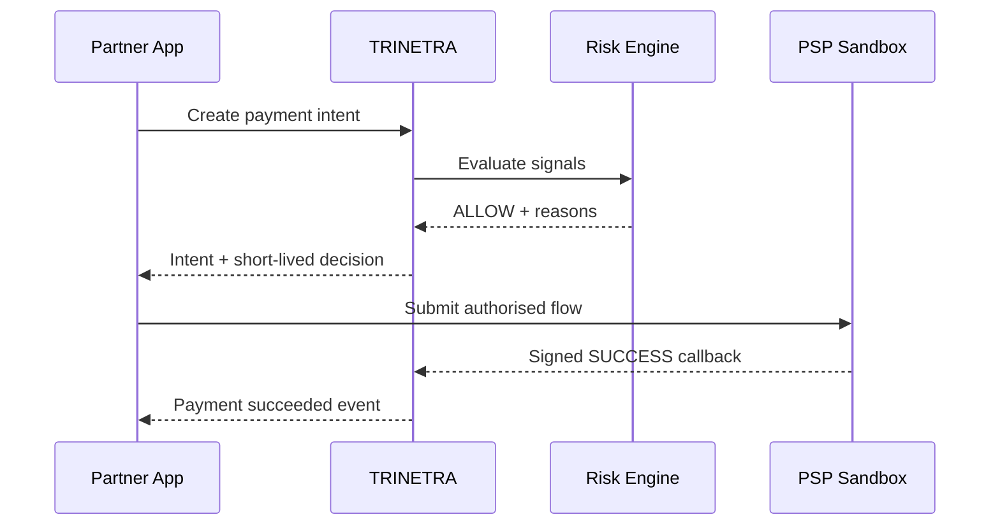
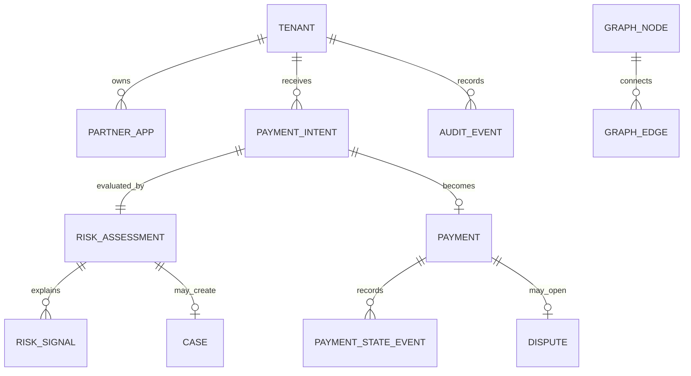
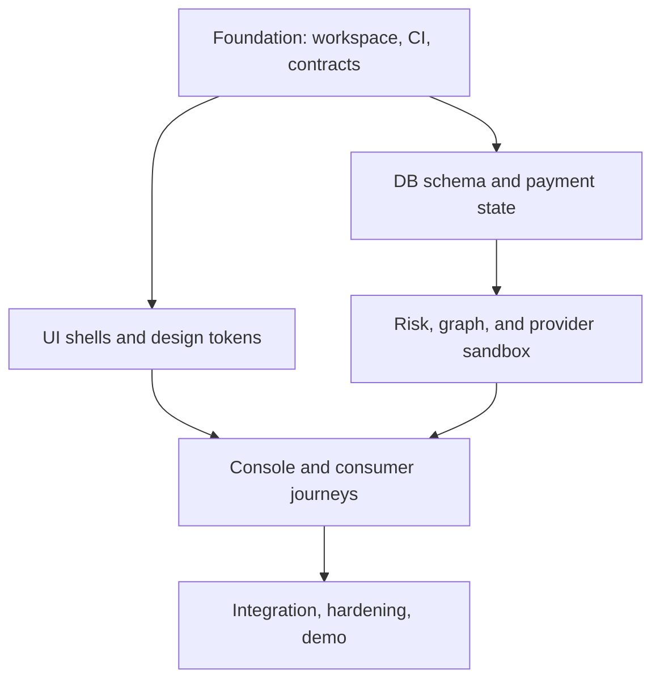

# TRINETRA — Master Product & Engineering Blueprint

> **Transaction Risk Intelligence & Networked Evaluation for Threat Response & Assurance**
> **Tagline:** _See the risk before the money moves._

| Field             | Locked decision                                                                               |
| ----------------- | --------------------------------------------------------------------------------------------- |
| Competition       | Decode SIH                                                                                    |
| Blueprint version | 1.0                                                                                           |
| Status            | Concept locked; implementation-ready                                                          |
| Date              | 10 August 2026                                                                                |
| Team              | Kavya Jain, Fuzail, Lakshya, Aryan, Keerti                                                    |
| Product category  | B2B2C UPI fraud-prevention and payment-resilience infrastructure                              |
| Primary buyer     | Banks, PSPs, TPAPs, merchant acquirers, payment aggregators                                   |
| Hackathon form    | Simulated PSP/acquirer sandbox + real risk, graph, recovery, case-management, and audit logic |

---

## 0. Executive lock

### One-line problem

UPI payments are instant, but fraud signals, payment-state uncertainty, user warnings, operational investigation, and failed-payment recovery are often handled as separate problems; this leaves users exposed to social engineering and leaves operators with fragmented decisions and reconciliation.

### One-line solution

TRINETRA is a partner-deployed control layer that evaluates a payment **before authorisation**, issues an explainable `ALLOW`, `WARN`, `STEP_UP`, or `BLOCK` decision, then tracks the payment through success, failure, reversal, dispute, and closure without unsafe duplicate retries.

### What is actually being built

TRINETRA combines four tightly connected capabilities:

1. **NETRA-I — Identity:** Is the payer, device, session, and partner request trustworthy?
2. **NETRA-II — Intent:** Does this payment match the user's normal behaviour and apparent intent?
3. **NETRA-III — Integrity:** Is the beneficiary, merchant, QR/deep link, and surrounding network trustworthy?
4. **Recovery Orchestrator:** If the transaction is pending, failed, or debited without confirmation, what is the safest next action?

### The non-negotiable product promise

> Every decision must be fast, explainable, auditable, privacy-minimised, and safe under retries.

### Why this is a serious problem

NPCI reports that in **July 2026**, UPI processed **23,658.35 million transactions** worth **₹29,87,880.49 crore** across **741 live banks**. At this scale, even a small fraud or failure rate creates substantial human and operational impact. The opportunity is not to replace UPI; it is to help authorised participants make better pre-transaction decisions and recover uncertain transactions safely.

Official source: [NPCI UPI Product Statistics](https://www.npci.org.in/product/upi/product-statistics)

---

## 1. Product truth and feasibility boundary

This section must be understood by every teammate before coding or pitching.

### 1.1 What TRINETRA is

- A fraud-risk and payment-resilience technology layer for an authorised ecosystem participant.
- A pre-authorisation policy engine that can advise or enforce a partner-defined decision.
- A transaction-state ledger that prevents blind retries and duplicate submissions.
- An explainable case-management and fraud-intelligence workbench.
- A merchant/partner SDK and API surface for risk checks, payment intent creation, status tracking, and reporting.
- A hackathon-safe simulated integration that exercises the same contracts and state transitions expected in a real partner deployment.

### 1.2 What TRINETRA is not

- It is **not** a replacement for NPCI, a bank, a PSP, or a TPAP.
- It does **not** connect directly to NPCI in the hackathon.
- It does **not** read, store, request, or validate the user's UPI PIN.
- It cannot reverse an already authorised instant payment by itself.
- It cannot place a network-wide hold on arbitrary consumer UPI payments.
- It does not promise to identify every fraud or eliminate false positives.
- It does not use real customer banking data in the demo.

### 1.3 What “block” means

In TRINETRA, `BLOCK` means the integrated partner refuses to initiate or continue the payment **before it is submitted for UPI authorisation**, according to that partner's policy. It does not mean TRINETRA independently blocks a transaction across the UPI network.

### 1.4 What “step-up” means

`STEP_UP` means the partner asks for an additional safe confirmation supported by its own product and compliance policy, such as:

- explicit re-confirmation of receiver name and amount;
- device biometric or app re-authentication;
- a short cooling-off period for a newly seen high-risk beneficiary;
- out-of-band confirmation for a high-value or anomalous payment;
- partner-side liveness or device-integrity check.

TRINETRA must never ask the user to enter a UPI PIN outside the authorised UPI application.

### 1.5 Real integration path

NPCI describes UPI participants as the UPI app, payer PSP, remitter bank, payee PSP, beneficiary bank, users, and merchants. A TPAP is onboarded through a sponsor bank, while a merchant accepts UPI through an acquiring bank. Therefore the realistic production path is:

1. Contract with a bank, PSP, TPAP, acquirer, or payment aggregator.
2. Integrate TRINETRA's API/SDK before the partner hands the payment to its UPI flow.
3. Receive signed provider callbacks or status responses after submission.
4. Reconcile and expose dispute/reporting journeys through the authorised partner.

Official source: [NPCI UPI overview and participant model](https://www.npci.org.in/product/upi/about-upi)

---

## 2. Problem decomposition

### 2.1 Fraud-side problems

| Fraud pattern                            | Signal available to TRINETRA                                                                              | Intended response              |
| ---------------------------------------- | --------------------------------------------------------------------------------------------------------- | ------------------------------ |
| QR replacement or merchant impersonation | Resolved payee differs from trusted merchant identity; unsigned/dynamic QR anomaly                        | Warn, step-up, or block        |
| Social-engineering collect request       | User expects to receive money but request would debit; unusual collect initiator                          | Plain-language intent warning  |
| New/high-risk beneficiary                | First-seen tokenised VPA, graph proximity to reported fraud, high amount                                  | Step-up or block               |
| Account/device takeover                  | New device, SIM/app reinstall signal, impossible travel, session anomaly                                  | Step-up or block               |
| Remote-access/screen-sharing scam        | Partner device SDK reports active screen sharing, suspicious overlay/accessibility state where OS permits | Block or high-friction warning |
| Mule-account network                     | Shared devices/IP clusters, repeated fan-in/fan-out, links to confirmed cases                             | Graph risk and analyst case    |
| Velocity abuse                           | Burst transactions, repeated declines, rapid beneficiary rotation                                         | Rate limit, step-up, or block  |
| Payment replay/duplicate                 | Reused idempotency key, nonce, provider reference, or callback                                            | Reject duplicate safely        |
| Merchant abuse                           | Abnormal refund ratio, descriptor mismatch, complaint concentration                                       | Merchant risk review           |

### 2.2 Failure-side problems

| Failure pattern                           | Dangerous behaviour              | TRINETRA behaviour                                                |
| ----------------------------------------- | -------------------------------- | ----------------------------------------------------------------- |
| Provider timeout before final status      | User/app retries immediately     | Mark `PENDING`; query status before retry                         |
| Account debited, beneficiary not credited | Treat as generic failure         | Track reversal clock and dispute eligibility                      |
| Merchant lacks confirmation               | Charge again                     | Preserve the original payment reference and reconcile             |
| Soft decline                              | Repeat without changing context  | Suggest a controlled retry only when state is definitively failed |
| Hard decline                              | Endless retries                  | Stop and explain non-retryable reason category                    |
| Duplicate callback                        | Apply state twice                | Idempotently acknowledge without duplicate mutation               |
| Out-of-order callback                     | Regress `SUCCEEDED` to `PENDING` | Enforce monotonic state transitions                               |

### 2.3 User pain

- Users cannot easily distinguish “pay” from deceptive “receive/refund” flows.
- A technically valid UPI PIN does not prove the user understood the beneficiary or scam context.
- Pending/failed payments create fear of double debit and duplicate payment.
- Complaint journeys are often opened after the user has already lost time and trust.

### 2.4 Operator pain

- Fraud rules produce alerts without a complete, readable evidence trail.
- Fraud, technical decline, reconciliation, and dispute data live in separate workflows.
- Analysts need reason codes and relationship context, not a black-box number.
- Repeated manual investigation increases mean time to resolution.

---

## 3. Target users and jobs-to-be-done

### 3.1 Primary stakeholders

| Stakeholder        | Job to be done                                           | TRINETRA value                                           |
| ------------------ | -------------------------------------------------------- | -------------------------------------------------------- |
| PSP/TPAP risk team | Reduce preventable fraud without blocking genuine users  | Explainable real-time decisions and rule tuning          |
| Bank fraud analyst | Investigate suspicious transactions quickly              | Timeline, graph context, evidence, and audit trail       |
| Merchant/acquirer  | Protect checkout and reduce duplicate/uncertain payments | Risk API, idempotency, status and recovery orchestration |
| Customer support   | Resolve “debited but not received” complaints            | Unified payment state and reversal clock                 |
| End user           | Know who they are paying and whether the action is risky | Contextual, plain-language warnings                      |
| Compliance/audit   | Reconstruct who or what made a decision                  | Immutable decision reasons and rule versions             |

### 3.2 Core user stories

- As a payer, I want to see the verified receiver and amount in plain language before a risky payment continues.
- As a partner, I want a risk decision in under 100 ms for the common path.
- As an analyst, I want every risk score decomposed into human-readable signals.
- As an operator, I want to change rule thresholds with approval and a full audit record.
- As support staff, I want to know whether a payment is pending, failed, reversed, or dispute-eligible.
- As a developer, I want idempotent APIs and signed callbacks so retries are safe.

---

## 4. Solution architecture

### 4.1 System context



In production, the simulated PSP boundary is replaced by the contracted partner's authorised UPI integration and provider callbacks. TRINETRA remains a risk/orchestration technology service and does not become the settlement network.

### 4.2 Logical components



### 4.3 Architectural style

Use a **TypeScript modular monolith** for the MVP, with independently testable modules and asynchronous workers. This gives strong boundaries without the deployment and debugging cost of premature microservices.

Locked MVP stack:

| Layer          | Choice                                            | Reason                                                                |
| -------------- | ------------------------------------------------- | --------------------------------------------------------------------- |
| Web apps       | React + TypeScript + Vite                         | Fast team delivery, typed UI contracts                                |
| API            | Node.js + TypeScript + Fastify                    | High-throughput, schema-driven, low overhead                          |
| Contracts      | Zod + generated OpenAPI                           | One source for validation and API docs                                |
| Database       | PostgreSQL + Drizzle ORM                          | Transactions, auditability, relational state, recursive graph queries |
| Cache/features | Redis                                             | Velocity windows, nonces, short-lived risk features                   |
| Jobs           | BullMQ                                            | Status checks, reversal timers, reconciliation, webhooks              |
| Tests          | Vitest + Supertest-style HTTP tests + Playwright  | Unit, integration, and end-to-end coverage                            |
| Local infra    | Docker Compose                                    | Reproducible onboarding and demo                                      |
| Observability  | Structured logs + OpenTelemetry-compatible traces | Trace a decision across modules                                       |

Deferred, not MVP-critical:

- Python anomaly-detection service;
- Kafka;
- Neo4j;
- Kubernetes;
- real bank/NPCI connectivity;
- real device SDK with OS-level compromise signals.

### 4.4 Why no heavy ML in the MVP

TRINETRA must work without a large proprietary fraud dataset. The MVP uses:

1. deterministic rules for known risk patterns;
2. per-user adaptive baselines using streaming statistics;
3. graph relationships derived from synthetic/reported entities;
4. explicit hard safety policies;
5. optional unsupervised anomaly scoring only after the deterministic path works.

This is more defensible than training a supervised “fraud AI” on an invented dataset.

---

## 5. The three-eye risk engine

### 5.1 NETRA-I: Identity trust

Evaluates whether the request source is trusted.

Candidate signals:

- device first-seen time and device-change recency;
- signed partner app identity;
- session age and recent re-authentication;
- IP/ASN reputation category;
- geovelocity or impossible-travel indicator;
- SIM/app reinstall or device-binding change supplied by partner;
- rooted/jailbroken/emulator indicator supplied by partner;
- callback/request signature validity;
- clock skew, nonce reuse, and replay detection.

### 5.2 NETRA-II: Intent confidence

Evaluates whether the payment resembles what the user appears to intend.

Candidate signals:

- amount deviation from rolling median and percentile bands;
- time-of-day deviation;
- new beneficiary plus high amount;
- first collect request from the counterparty;
- rapid repeated attempts or repeated PIN/business declines reported by partner;
- payee confirmation dwell time and warning acknowledgement;
- user selected “I am receiving money” while flow would debit;
- recent remote-support/screen-sharing signal;
- unusual payment purpose or merchant category.

### 5.3 NETRA-III: Integrity and network trust

Evaluates the destination and transaction context.

Candidate signals:

- beneficiary/merchant first seen in the tenant network;
- trusted merchant identity versus resolved payee mismatch;
- signed QR validity and amount tampering;
- graph distance to confirmed fraud reports;
- shared device/IP/payment-instrument clusters;
- complaint concentration and confirmed-case ratio;
- abnormal fan-in/fan-out behaviour;
- risky merchant category or partner policy;
- provider or bank health and technical-decline rate.

### 5.4 Score model

Each eye returns a sub-score and reasons:

| Component      | Range | Default weight |
| -------------- | ----: | -------------: |
| Identity risk  | 0–100 |            35% |
| Intent risk    | 0–100 |            35% |
| Integrity risk | 0–100 |            30% |

```text
baseRisk = round(identity × 0.35 + intent × 0.35 + integrity × 0.30)
finalRisk = clamp(baseRisk + policyAdjustments, 0, 100)
```

Hard rules can override the weighted score. Examples: invalid request signature, replayed nonce, confirmed fraudulent beneficiary, or tampered signed merchant QR.

### 5.5 Default decision bands

|  Score | Decision  | Behaviour                                                                 |
| -----: | --------- | ------------------------------------------------------------------------- |
|   0–29 | `ALLOW`   | Continue without added friction                                           |
|  30–54 | `WARN`    | Show receiver, amount, and specific risk message; require acknowledgement |
|  55–74 | `STEP_UP` | Require partner-supported confirmation or cooling-off action              |
| 75–100 | `BLOCK`   | Do not submit payment; open/append case where policy requires             |

These values are tenant-configurable. Every response must contain stable reason codes, user-safe text, analyst detail, rule version, and a trace identifier.

### 5.6 Example reason codes

| Code                         | Analyst meaning                                                   | User-facing wording                                             |
| ---------------------------- | ----------------------------------------------------------------- | --------------------------------------------------------------- |
| `BENEFICIARY_FIRST_SEEN`     | Tokenised beneficiary has no prior successful relationship        | “You have not paid this receiver before.”                       |
| `AMOUNT_ABOVE_USER_P99`      | Amount exceeds user's adaptive 99th percentile                    | “This amount is much higher than your usual payments.”          |
| `PAYEE_MERCHANT_MISMATCH`    | Resolved payee differs from expected merchant                     | “The receiver does not match the merchant you selected.”        |
| `COLLECT_INTENT_CONFLICT`    | User expects credit but request causes debit                      | “Receiving money never requires approving a debit request.”     |
| `REMOTE_ACCESS_ACTIVE`       | Partner supplied active screen-sharing/remote-control risk        | “A screen-sharing or remote-access session may be active.”      |
| `GRAPH_NEAR_CONFIRMED_FRAUD` | Destination is within configured graph hops of a confirmed entity | “This receiver is linked to previously reported activity.”      |
| `DUPLICATE_INTENT`           | Equivalent intent/idempotency key already exists                  | “This payment is already being processed.”                      |
| `PROVIDER_HEALTH_DEGRADED`   | Elevated technical decline or timeout rate                        | “Your bank or payment provider may be temporarily unavailable.” |

### 5.7 Explainability contract

A risk response is invalid unless it contains:

- final decision and score;
- all three sub-scores;
- top reason codes ordered by impact;
- exact rule-set version;
- evidence references without raw secrets/PII;
- request/trace ID;
- expiry time for the decision;
- recommended next action;
- whether an operator case was created.

---

## 6. Payment resilience and recovery orchestrator

### 6.1 Payment state machine



### 6.2 State-safety rules

1. A payment state may never move backward because of an old callback.
2. Every provider callback must be authenticated and idempotent.
3. `PENDING` is not retryable until the original attempt reaches a definitive state or partner policy explicitly permits a new intent.
4. The idempotency key is unique per tenant and payment operation.
5. A provider reference, once bound, cannot be rebound to another payment.
6. State changes and their evidence are append-only in `payment_state_events`.
7. Customer-facing labels must distinguish `FAILED`, `PENDING`, and `REVERSED`.

### 6.3 Failure taxonomy

| Class               | Examples                                                              | Retry policy                                                   |
| ------------------- | --------------------------------------------------------------------- | -------------------------------------------------------------- |
| Technical/transient | Network timeout, provider unavailable                                 | Status first; bounded retry with backoff only after safe state |
| Business/soft       | Daily limit, insufficient balance, incorrect PIN reported by provider | Do not auto-retry; user may retry after correcting condition   |
| Hard/non-retryable  | Invalid beneficiary, blocked account, policy prohibition              | Stop; require corrected details or support                     |
| Unknown/pending     | Submission accepted but final response absent                         | Poll/reconcile; never blind retry                              |
| Duplicate/replay    | Same request/idempotency key/provider ref                             | Return original outcome                                        |

### 6.4 Reversal and dispute clocks

RBI's failed-transaction framework states that for UPI fund transfers where the originator is debited but the beneficiary is not credited, auto-reversal is due by **T+1 day**; for merchant payments where the account is debited but confirmation is not received at the merchant, auto-reversal is due within **T+5 days**. The framework specifies ₹100 per day of delay beyond the applicable timeline. TRINETRA will track these clocks for operator/customer visibility; the authorised bank/participant remains responsible for actual reversal and compensation.

Official source: [RBI Harmonisation of TAT and customer compensation](https://www.rbi.org.in/commonman/English/scripts/Notification.aspx?Id=3074)

RBI also requires authorised payment operators and participants to provide a rule-based, transparent ODR mechanism for failed-payment disputes, and UPI TPAPs must offer in-app grievance access integrated with that system. TRINETRA's dispute module is designed as a partner integration surface, not an independent RBI grievance authority.

Official source: [RBI Online Dispute Resolution for Digital Payments](https://www.rbi.org.in/commonman/english/scripts/Notification.aspx?Id=3194)

### 6.5 Recovery jobs

- `status-inquiry`: polls/queries the provider adapter for pending payments;
- `pending-timeout`: escalates unresolved states without mutating them to failed blindly;
- `reversal-watch`: tracks T+1/T+5 clocks by payment type;
- `reconciliation-import`: compares provider settlement/status files with the ledger;
- `webhook-delivery`: sends signed partner events with retry and dead-letter handling;
- `dispute-reminder`: escalates cases nearing response/TAT deadlines;
- `feature-aggregation`: updates velocity and baseline features asynchronously.

---

## 7. Golden-path transaction flows

### 7.1 Normal allowed payment



### 7.2 Risky payment

1. Partner creates intent with payee, amount, merchant context, device/session token, and user-intent context.
2. TRINETRA validates partner signature, timestamp, nonce, idempotency key, and schema.
3. The feature service reads short-lived velocity signals and tokenised relationship history.
4. Three-eye engine returns a score and reasons.
5. `WARN` or `STEP_UP` returns a challenge with expiry and allowed completion methods.
6. User sees a precise warning—not generic “payment risky” text.
7. Challenge result is recorded; expired decisions must be re-evaluated.
8. A hard-rule or high score returns `BLOCK`; nothing is sent to the provider.

### 7.3 Pending and safe recovery

1. Payment is submitted once with a unique provider request reference.
2. Provider times out, so TRINETRA marks it `PENDING`, not `FAILED`.
3. Duplicate client requests return the original payment resource.
4. Worker performs signed status inquiries with bounded exponential backoff.
5. If provider later confirms success, state becomes `SUCCEEDED`.
6. If provider confirms non-credit/debit scenario, reversal tracking begins.
7. If the regulatory/partner clock is crossed, the console flags escalation and complaint eligibility.

---

## 8. MVP feature scope

### 8.1 Must-have MVP

| Module             | Required capability                                        | Demo acceptance                                      |
| ------------------ | ---------------------------------------------------------- | ---------------------------------------------------- |
| Partner onboarding | Seeded tenant, API key, HMAC secret, environment           | Partner can authenticate requests                    |
| Payment intents    | Create/retrieve intent with idempotency                    | Duplicate create returns same intent                 |
| Risk engine        | Three sub-scores, rules, four decisions, reasons           | Four curated risk scenarios behave deterministically |
| Adaptive features  | Rolling amount/velocity/beneficiary history                | Baseline changes from seeded event history           |
| Graph intelligence | Tokenised nodes/edges and fraud proximity                  | Mule-linked beneficiary visibly increases risk       |
| Challenge flow     | Warning/step-up completion and expiry                      | Payment cannot submit on expired challenge           |
| PSP sandbox        | Configurable success, pending, soft/hard failure, reversal | One-click scenario control                           |
| Payment ledger     | Monotonic state transitions and event history              | Out-of-order callback cannot regress state           |
| Recovery worker    | Status-first pending recovery and reversal clocks          | Pending resolves without duplicate submission        |
| Case console       | Queue, case detail, evidence, assign, status, notes        | Analyst can resolve/escalate a case                  |
| Rule studio        | View rule versions and simulate changes                    | Rule change is audit logged                          |
| Dispute center     | Create/track failed-payment dispute                        | Unique reference and TAT clock visible               |
| Audit log          | Actor, action, before/after refs, timestamp, trace         | Critical actions are reconstructable                 |
| Demo dashboard     | Live throughput, decisions, risk reasons, pending payments | Updates from real backend events                     |

### 8.2 Stretch goals

- shadow mode that scores without enforcement;
- rule backtesting against synthetic historical events;
- analyst feedback loop for false-positive labels;
- multi-hop network graph visualisation;
- WebAuthn/operator SSO;
- multilingual end-user warnings;
- unsupervised anomaly score as a fourth supporting signal;
- provider health routing across multiple adapters;
- signed merchant QR verification proof-of-concept.

### 8.3 Explicitly out of scope for Decode SIH

- production money movement;
- raw bank account/UPI PIN storage;
- direct NPCI certification or integration;
- universal mobile screen monitoring;
- automated freezing of external bank accounts;
- real FIU-IND/1930/cybercrime reporting without an authorised partner workflow;
- claims of regulatory approval;
- facial recognition or invasive surveillance;
- a black-box model trained on fabricated “real” fraud data.

---

## 9. User experience and interface blueprint

### 9.1 Visual direction

TRINETRA should look like credible payment infrastructure, not a generic AI dashboard.

- **Palette:** obsidian/charcoal base, controlled vermilion risk accent, warm ivory text, green reserved only for safe/success states.
- **Identity:** a precise three-lens/three-ray mark representing Identity, Intent, and Integrity; do not merge the TRINETRA mark with the official UPI logo.
- **Density:** institutional tables, timelines, and split views; avoid placing every element inside a floating card.
- **Typography:** clean grotesk/sans for operations; tabular numerals for scores, timestamps, and amounts.
- **Motion:** restrained status transitions and graph highlighting; no decorative glowing particles.
- **Accessibility:** WCAG-conscious contrast, icons plus text, keyboard navigation, no risk conveyed by colour alone.

NPCI's current brand guidance requires the UPI identity to remain standalone and not be merged or modified with a partner logo. If the UPI mark appears in a pitch or UI mock, keep it separate and follow the official clear-space rules.

Official source: [NPCI BHIM/UPI brand guidelines](https://www.npci.org.in/uploads/BHIM_UPI_Guidelines_2026_012a0b1bce.pdf)

### 9.2 Operations console information architecture

| Screen              | Primary content                                                                                   |
| ------------------- | ------------------------------------------------------------------------------------------------- |
| Command Center      | Live decisions, blocked amount, false-positive feedback, provider health, pending/reversal clocks |
| Transaction Stream  | Searchable live table with decision, score, state, partner, amount, reason                        |
| Investigation Case  | Evidence timeline, three-eye score, graph context, notes, assignment, resolution                  |
| Network Graph       | Tokenised entities, relationship types, risk propagation, confirmed-case anchors                  |
| Rule Studio         | Rule list, version diff, test fixture, approve/publish/rollback                                   |
| Recovery Center     | Pending, failed, reversal-due, disputed transactions and SLA/TAT timers                           |
| Partner Integration | API keys metadata, webhook endpoints, signing status, delivery logs                               |
| Audit & Reports     | Immutable action trail, exported synthetic demo report, operational KPIs                          |
| Scenario Lab        | One-click fraud/failure scenarios for judges and tests                                            |

### 9.3 Command Center layout

- Top status rail: environment, partner tenant, API health, provider health, worker lag.
- Left 62%: live transaction stream with inline reason chips and state changes.
- Right 38%: decision distribution, top rules, pending/reversal queue.
- Bottom full-width: time-series of allowed/warned/blocked/failed with selectable window.
- Case drawer opens without losing the stream context.

### 9.4 End-user challenge screen

Must show:

- verified/resolved receiver name;
- exact amount;
- whether the action sends or receives money;
- one to three specific risk reasons;
- safe action choices;
- “Cancel payment” as the prominent safe option;
- no request for UPI PIN;
- an anti-scam reminder from NPCI guidance: entering a UPI PIN authorises a debit, not receipt of money.

Official source: [NPCI UPI Safety Shield](https://www.npci.org.in/safety-feature)

---

## 10. Data architecture

### 10.1 Data principles

1. Store only what is needed for risk, recovery, audit, and demo.
2. Tokenise VPAs, phone numbers, device IDs, IPs, and partner customer identifiers using tenant-scoped keyed hashing.
3. Never store UPI PIN, OTP, full account number, or unmasked payment credentials.
4. Separate user-safe explanations from analyst-only evidence.
5. Encrypt secrets and sensitive fields; redact logs by default.
6. Keep immutable event history separate from mutable projections.
7. Use synthetic data only for the hackathon.

### 10.2 Core entity model



### 10.3 Required tables

#### Tenant and access

- `tenants`
- `partner_apps`
- `operator_users`
- `roles`
- `role_bindings`
- `api_credentials`
- `webhook_endpoints`

#### Transaction lifecycle

- `payment_intents`
- `payments`
- `payment_state_events`
- `provider_attempts`
- `provider_events`
- `idempotency_records`
- `reconciliation_records`

#### Risk and graph

- `risk_assessments`
- `risk_signals`
- `rules`
- `rule_versions`
- `rule_evaluations`
- `entity_features`
- `graph_nodes`
- `graph_edges`
- `fraud_labels`

#### Operations

- `cases`
- `case_events`
- `case_notes`
- `disputes`
- `dispute_events`
- `audit_events`
- `outbox_events`
- `webhook_deliveries`

### 10.4 Critical constraints

- Unique: `(tenant_id, idempotency_key, operation)`.
- Unique: `(tenant_id, provider_reference)` when provider reference exists.
- Foreign keys include tenant boundaries or are checked through composite keys.
- Payment-state update uses optimistic version or row lock.
- Rule versions are immutable after publication.
- Audit and state events are append-only to the application role.
- Soft-deleted partner/operator records remain referentially resolvable for audit.
- Amounts use integer paise, never floating point.
- Timestamps use UTC internally and render in selected local timezone.

### 10.5 Graph model

Node types:

- `CUSTOMER_TOKEN`
- `DEVICE_TOKEN`
- `BENEFICIARY_TOKEN`
- `MERCHANT_TOKEN`
- `IP_PREFIX_TOKEN`
- `PAYMENT`
- `CASE`

Edge types:

- `USED_DEVICE`
- `PAID`
- `RECEIVED`
- `SHARED_IP_PREFIX`
- `LINKED_MERCHANT`
- `REPORTED_IN`
- `DUPLICATES`

MVP graph risk is computed with bounded two-hop traversal and capped contribution. A graph relationship is a risk signal—not proof of guilt.

### 10.6 Retention tiers

| Data                  |                  MVP default | Production note                      |
| --------------------- | ---------------------------: | ------------------------------------ |
| Nonce/replay keys     |                10–30 minutes | Based on signature validity window   |
| Hot velocity features |                  24–72 hours | Redis with durable aggregation       |
| Payment lifecycle     |  Hackathon duration + export | Contract/regulation-defined          |
| Risk evidence         |    Same as payment/case need | Minimise and purpose-bind            |
| Operator audit        | Entire demo/project lifetime | Longer regulated retention may apply |
| Raw simulator events  |                  Regenerable | Safe to reset between demos          |

RBI's payment-data direction applies to authorised system providers and their engaged ecosystem partners, and requires domestic payment-system data to be stored in India. A production deployment must therefore be designed with the authorised participant's compliance and India data-residency obligations; the hackathon uses synthetic data only.

Official source: [RBI Storage of Payment System Data FAQ](https://www.rbi.org.in/commonman/english/scripts/FAQs.aspx?Id=2995)

---

## 11. API and event contracts

### 11.1 Contract rules

- Base path: `/v1`.
- JSON request/response contracts are defined in Zod and published as OpenAPI.
- Every write accepts `Idempotency-Key`.
- Partner requests include `X-Partner-Key`, `X-Timestamp`, `X-Nonce`, and `X-Signature`.
- Signature covers method, canonical path, timestamp, nonce, and SHA-256 body digest.
- Responses include `trace_id` and resource version.
- Errors use stable machine codes; raw provider/internal messages never leak.
- Pagination uses cursor, not unbounded offset.

### 11.2 Core endpoints

| Method  | Endpoint                               | Purpose                                          |
| ------- | -------------------------------------- | ------------------------------------------------ |
| `POST`  | `/v1/payment-intents`                  | Create and evaluate a payment intent             |
| `GET`   | `/v1/payment-intents/{id}`             | Retrieve current intent and decision             |
| `POST`  | `/v1/payment-intents/{id}/re-evaluate` | Re-evaluate after material context change/expiry |
| `POST`  | `/v1/challenges/{id}/complete`         | Record partner-supported step-up outcome         |
| `POST`  | `/v1/payments/{id}/submit`             | Submit to sandbox/provider adapter once eligible |
| `GET`   | `/v1/payments/{id}`                    | Retrieve payment and state history               |
| `POST`  | `/v1/provider-events/{provider}`       | Receive authenticated provider callbacks         |
| `POST`  | `/v1/payments/{id}/reports`            | Report suspected fraud/unauthorised activity     |
| `POST`  | `/v1/payments/{id}/disputes`           | Create a failed-payment dispute                  |
| `GET`   | `/v1/cases`                            | Filter analyst queue                             |
| `GET`   | `/v1/cases/{id}`                       | Retrieve evidence and timeline                   |
| `PATCH` | `/v1/cases/{id}`                       | Assign/update with optimistic version            |
| `GET`   | `/v1/rules`                            | List rules and published versions                |
| `POST`  | `/v1/rule-versions/{id}/simulate`      | Run rule against fixtures                        |
| `POST`  | `/v1/rule-versions/{id}/publish`       | Approved, audited publish                        |
| `POST`  | `/v1/simulator/scenarios/{key}/run`    | Development/demo only                            |

### 11.3 Example payment-intent request

```json
{
  "partner_customer_ref": "cust_demo_104",
  "direction": "PUSH",
  "payment_type": "P2M",
  "amount_paise": 249900,
  "currency": "INR",
  "beneficiary": {
    "vpa_token": "vpa_tok_8ca...",
    "resolved_name": "Aarav Electronics"
  },
  "merchant": {
    "merchant_ref": "m_demo_12",
    "expected_name": "Aarav Electronics",
    "mcc": "5732"
  },
  "context": {
    "channel": "UPI_INTENT",
    "device_token": "dev_tok_31b...",
    "session_ref": "sess_6de...",
    "user_claimed_goal": "PAY_MERCHANT",
    "remote_access_active": false
  }
}
```

### 11.4 Example risk response

```json
{
  "payment_intent_id": "pi_01J...",
  "decision": "STEP_UP",
  "risk_score": 68,
  "subscores": {
    "identity": 42,
    "intent": 82,
    "integrity": 79
  },
  "reasons": [
    {
      "code": "PAYEE_MERCHANT_MISMATCH",
      "impact": 24,
      "user_message": "The receiver does not match the selected merchant."
    },
    {
      "code": "AMOUNT_ABOVE_USER_P99",
      "impact": 17,
      "user_message": "This amount is much higher than your usual payments."
    }
  ],
  "required_action": {
    "type": "RECONFIRM_RECEIVER",
    "expires_at": "2026-08-10T12:05:00Z"
  },
  "rule_set_version": "ruleset_12",
  "case_id": null,
  "trace_id": "tr_01J..."
}
```

### 11.5 Domain events

- `payment_intent.created`
- `risk_assessment.completed`
- `risk_decision.allowed`
- `risk_decision.warned`
- `risk_decision.challenged`
- `risk_decision.blocked`
- `payment.submitted`
- `payment.state_changed`
- `payment.reversal_due`
- `payment.reversed`
- `fraud_report.created`
- `case.created`
- `case.updated`
- `dispute.created`
- `dispute.sla_at_risk`
- `rule_version.published`

Use the transactional outbox pattern: database state and the corresponding outbox event commit in one transaction; workers publish/deliver asynchronously.

---

## 12. Security, privacy, and compliance blueprint

### 12.1 Security posture

TRINETRA is designed as if it were handling payment metadata even though the hackathon environment uses synthetic data. Security controls are part of the product, not a final-day checklist.

### 12.2 Partner API security

- Tenant-scoped API credentials; secret shown only once.
- HMAC-SHA256 request signing with timestamp, nonce, method, path, and body digest.
- Five-minute default clock-skew window.
- Redis nonce cache to reject replays.
- Idempotency keys for every write/payment operation.
- Per-tenant and per-credential rate limits.
- Credential rotation with overlapping grace window.
- Separate credentials for test and demo environments.
- Request body size and content-type limits.
- Schema reject unknown dangerous fields where appropriate.
- Never place credentials, VPAs, account identifiers, or signatures in URLs.

### 12.3 Provider callback security

- Provider-specific signature adapter.
- Verify signature before parsing into a domain event.
- Persist raw callback only after redaction/encryption policy; prefer canonical safe subset in MVP.
- Unique callback/event ID.
- Timestamp/nonce replay protection.
- Callback state transitions checked against current version.
- Acknowledge duplicate delivery idempotently.
- Quarantine invalid or contradictory events for analyst review.

### 12.4 Operator security

- Role-based permissions: `VIEWER`, `ANALYST`, `RULE_AUTHOR`, `RULE_APPROVER`, `TENANT_ADMIN`.
- No user can both author and approve a production rule in the target production model.
- Sensitive actions require recent authentication.
- Session cookies are `HttpOnly`, `Secure`, and `SameSite` restricted.
- Passwords, if used in the demo, are Argon2id-hashed; production should prefer enterprise OIDC/SSO.
- Login, export, rule publish, credential rotation, case override, and dispute actions are audit logged.
- UI never relies on hidden buttons as authorisation; API enforces permissions.

### 12.5 Secrets and encryption

- `.env` files are never committed.
- Repository contains `.env.example` with non-secret placeholders.
- Secrets are provided by deployment secret storage.
- TLS for all external traffic.
- Database encryption at rest via infrastructure, plus application-level encryption for selected sensitive fields.
- Tenant-scoped keyed hashes for equality/graph joins on identifiers.
- Key version stored with encrypted/tokenised fields to support rotation.

### 12.6 Logging and redaction

Redact by key and pattern:

- `authorization`, `cookie`, `set-cookie`;
- `x-partner-key`, `x-signature`, API secrets;
- password, PIN, OTP, token, secret;
- raw VPA, phone, email, account/card identifiers;
- session/device identifiers before tokenisation.

Unknown production errors return a generic code and `trace_id`. Detailed stack traces stay out of client responses.

### 12.7 Threat model

| Threat                          | Failure mode                                  | Primary controls                                                  |
| ------------------------------- | --------------------------------------------- | ----------------------------------------------------------------- |
| Partner spoofing                | Attacker submits fake payment context         | API key + HMAC + nonce + timestamp                                |
| Replay attack                   | Valid signed payment is repeated              | Nonce cache + idempotency + unique provider refs                  |
| Callback forgery                | Payment is marked successful/failed falsely   | Provider signature verification + adapter isolation               |
| Duplicate/out-of-order callback | Ledger applies event twice or regresses       | Event uniqueness + monotonic state machine + version lock         |
| Tenant data leak                | One partner reads another's data              | Tenant-scoped queries, composite constraints, auth tests          |
| Rule tampering                  | Risk threshold secretly weakened              | RBAC, maker-checker approval, immutable versions, audit           |
| Sensitive-log leak              | PII/secrets appear in logs                    | Central redaction and log regression tests                        |
| Analyst abuse                   | Case data exported or modified improperly     | Least privilege, export permission, audit, alerts                 |
| Denial of service               | Risk API unavailable during checkout          | Rate limits, bounded work, cache, circuit breaker, backpressure   |
| Feature manipulation            | Attacker crafts low-risk metadata             | Server/partner-attested features; never trust client claims alone |
| Graph overreach                 | Innocent entity penalised by weak association | Bounded contribution, evidence display, human review, expiry      |
| Supply-chain compromise         | Malicious dependency/build                    | Lockfile, dependency review, CI audit, minimal packages           |

### 12.8 Failure policy of the risk service

Risk infrastructure failure must not silently become `ALLOW`.

- Invalid authentication/signature: always fail closed.
- Confirmed hard policy signal: always block according to tenant policy.
- Feature store partially unavailable: compute with available signals, mark degraded confidence, and apply configured safe fallback.
- Complete risk-engine outage: high-value/high-risk category defaults to `BLOCK`; lower-risk flows default to `STEP_UP` or partner-configured fail-safe—not invisible allow.
- Provider outage: do not submit; show availability status and preserve the intent.

### 12.9 Regulatory alignment—not a certification claim

| Requirement/theme                   | Blueprint alignment                                                                            | Production responsibility                               |
| ----------------------------------- | ---------------------------------------------------------------------------------------------- | ------------------------------------------------------- |
| Suspicious-behaviour parameters     | Velocity, geolocation category, device, beneficiary, decline, merchant and behavioural signals | Regulated entity defines/approves policy                |
| Real-/near-real-time reconciliation | Ledger, provider events, import job, status worker, 24-hour escalation                         | Regulated entity/partner integrates official files/APIs |
| Secure development and VA/PT        | CI controls, code review, dependency checks, planned VA/PT                                     | Accredited/required audits before production            |
| Customer grievance access           | In-app dispute/report flow and status reference                                                | Authorised participant connects official ODR            |
| Customer fraud reporting            | Immediate acknowledgement and case reference                                                   | Bank/partner provides 24x7 official channels and action |
| Payment-data storage in India       | India-region target and synthetic-only hackathon data                                          | PSO/partner ensures full regulatory compliance          |
| Customer liability protection       | Evidence timestamps and immediate report event                                                 | Bank applies RBI liability rules                        |

RBI's Digital Payment Security Controls require regulated entities to document suspicious-transaction rules, monitor parameters such as velocity, geo-location, beneficiary reputation and declined transactions, conduct fraud analysis, and maintain near-real-time reconciliation. They also prescribe security testing and customer grievance controls. TRINETRA is architected to support those obligations for a partner; this prototype is not itself RBI/NPCI-approved.

Official source: [RBI Master Direction on Digital Payment Security Controls](https://www.rbi.org.in/Scripts/BS_ViewMasDirections.aspx?id=12032)

RBI's customer-protection direction calls for robust fraud detection, immediate multi-channel reporting, complaint acknowledgement, and steps to prevent further unauthorised transactions. TRINETRA records event timestamps and complaint references to support such a workflow.

Official source: [RBI Limiting Liability for Unauthorised Electronic Banking Transactions](https://www.rbi.org.in/commonman/english/scripts/Notification.aspx?Id=2336)

---

## 13. Reliability, performance, and observability

### 13.1 Service-level objectives for the demo

These are engineering targets, not claimed production results.

| Metric                          |                                                   Target |
| ------------------------------- | -------------------------------------------------------: |
| Risk decision latency           |               p95 < 100 ms; p99 < 200 ms under demo load |
| Payment-intent API latency      |                   p95 < 180 ms including risk evaluation |
| Explainability coverage         |       100% of decisions include reasons and rule version |
| Duplicate submission prevention |                               100% in automated fixtures |
| Callback idempotency            |              100% in repeated/out-of-order fixture suite |
| Dashboard update                |              Within 2 seconds of committed backend event |
| Worker recovery                 | Restart-safe; no job causes duplicate payment submission |
| Demo availability               |         Clean boot and scripted reset in under 3 minutes |

### 13.2 Performance design

- Risk evaluation performs no unbounded graph traversal.
- Hot velocity/baseline features live in Redis; durable aggregates live in PostgreSQL.
- Rules compile to an internal representation when published, not on every request.
- Graph traversal is limited by tenant, hop count, time window, and maximum nodes.
- Slow case enrichment runs asynchronously after the synchronous decision.
- Database indexes follow query plans, not guesses.
- Pagination and maximum time windows protect analyst endpoints.

### 13.3 Resilience patterns

- Transactional outbox for committed events.
- Bounded exponential backoff with jitter.
- Dead-letter queues for exhausted jobs/webhooks.
- Circuit breaker around provider adapter.
- Idempotent consumers.
- Health endpoints separated into liveness and readiness.
- Graceful shutdown drains API requests and workers.
- Database migrations are forward-compatible with rolling deploys where possible.
- Demo reset uses a safe seeded environment, never destructive broad paths.

### 13.4 Observability contract

Every payment intent carries one trace across:

1. API authentication;
2. feature lookup;
3. rule evaluation;
4. decision persistence;
5. provider submission/callback;
6. payment state update;
7. worker recovery;
8. partner webhook.

Required telemetry:

- structured JSON logs;
- trace ID, tenant ID, resource ID, module, event, safe status;
- request count, error rate, latency histograms;
- decision distribution and top reason codes;
- provider timeout/technical-decline rate;
- pending age and reversal-clock breaches;
- queue depth/lag and webhook failures;
- rule publish and override audit counters.

No metric or trace label may contain raw PII or high-cardinality secrets.

---

## 14. Repository and code architecture

### 14.1 Monorepo structure

```text
trinetra/
├── apps/
│   ├── api/                    # Fastify HTTP API and modular composition
│   ├── web/                    # Operations console
│   ├── consumer-demo/          # Payer/merchant challenge and payment demo
│   ├── worker/                 # BullMQ recovery, webhook, reconciliation jobs
│   └── psp-sandbox/            # Deterministic simulated provider
├── packages/
│   ├── contracts/              # Zod schemas, OpenAPI, event contracts
│   ├── database/               # Drizzle schema, migrations, repositories
│   ├── risk-core/              # Rules, scoring, reasons, policy engine
│   ├── graph-core/             # Bounded graph queries and propagation
│   ├── payment-core/           # State machine and idempotency primitives
│   ├── security/               # Signing, tokenisation, redaction, RBAC helpers
│   ├── observability/          # Logger, metrics, trace helpers
│   ├── ui/                     # Shared components and tokens
│   └── config/                 # Shared TS/ESLint/format configuration
├── docs/
│   ├── MASTER_BLUEPRINT.md
│   ├── ARCHITECTURE.md
│   ├── API_AND_EVENTS.md
│   ├── DATA_AND_SECURITY.md
│   ├── DEMO_RUNBOOK.md
│   └── TEAM_WORKFLOW.md
├── infra/
│   ├── docker-compose.yml
│   ├── dashboards/
│   └── deployment/
├── scripts/
│   ├── seed-demo.ts
│   ├── reset-demo.ts
│   └── verify-repo.ts
├── .github/
│   ├── workflows/ci.yml
│   ├── CODEOWNERS
│   └── pull_request_template.md
├── AGENTS.md
├── pnpm-workspace.yaml
├── package.json
└── README.md
```

### 14.2 Backend module boundaries

Inside `apps/api`, modules may call each other only through exported application services/contracts:

- `auth`
- `tenants`
- `payment-intents`
- `risk`
- `rules`
- `features`
- `graph`
- `payments`
- `providers`
- `cases`
- `disputes`
- `audit`
- `webhooks`
- `simulator-admin` (non-production only)

No route handler contains scoring or state-transition logic. No UI directly infers a payment state from provider text.

### 14.3 Shared contract discipline

- API and event schemas originate in `packages/contracts`.
- Database rows are not returned directly from API handlers.
- Domain enums are defined once.
- Breaking contract changes require versioning/migration notes.
- Provider-specific codes are mapped to internal canonical categories at the adapter boundary.
- Risk reasons are stable codes; text can evolve without breaking clients.

### 14.4 Database transaction boundaries

Atomic operations include:

- create idempotency record + payment intent + initial event;
- persist risk assessment + reasons + decision + outbox event;
- transition payment state + append state event + outbox event;
- publish rule version + audit event;
- open dispute + reference + audit/outbox event.

External network calls are not held inside long database transactions.

---

## 15. Synthetic data and scenario laboratory

### 15.1 Why synthetic data

The team does not need a massive private banking dataset to prove the architecture. Synthetic fixtures make every judge demo reproducible, label-aware, privacy-safe, and testable.

### 15.2 Seed dataset

- 3 partner tenants;
- 25 synthetic customers;
- 40 tokenised devices;
- 30 merchants across safe/risky MCC fixtures;
- 80 tokenised beneficiaries;
- 1,500 historical payment events;
- 3 synthetic mule clusters;
- 20 confirmed/cleared case labels;
- configurable provider health timeline;
- known transaction baselines per demo customer.

### 15.3 Required one-click scenarios

#### Scenario A — trusted everyday payment

- Known device and merchant.
- Amount within normal range.
- Prior successful relationship.
- Outcome: `ALLOW`, low score, success callback.

#### Scenario B — deceptive “receive refund” collect request

- User chooses “I am receiving money.”
- Flow is actually a debit collect request.
- New beneficiary and active remote-access flag.
- Outcome: `BLOCK` with plain-language intent conflict.

#### Scenario C — QR/payee mismatch

- UI merchant is “Metro Café.”
- Resolved receiver is an unrelated personal VPA token.
- Amount above normal café spend.
- Outcome: `STEP_UP` or `BLOCK` per locked demo rule.

#### Scenario D — mule-network proximity

- Beneficiary is two hops from two confirmed synthetic fraud cases.
- Same IP prefix/device cluster receives from multiple new users.
- Outcome: integrity score spike and analyst case with graph evidence.

#### Scenario E — timeout without duplicate debit

- Provider accepts submission, then returns timeout.
- User retries with same idempotency key.
- Outcome: original `PENDING` resource returned; worker later resolves `SUCCEEDED`.

#### Scenario F — debit but merchant confirmation missing

- Provider fixture enters reversal-monitoring path.
- Outcome: recovery center shows T+5 clock, dispute action, and later `REVERSED` event.

### 15.4 Simulator controls

The PSP sandbox can deterministically select:

- `SUCCESS_IMMEDIATE`
- `TIMEOUT_THEN_SUCCESS`
- `PENDING_THEN_SUCCESS`
- `PENDING_THEN_REVERSED`
- `SOFT_DECLINE`
- `HARD_DECLINE`
- `TIMEOUT_UNKNOWN`
- `DUPLICATE_CALLBACK`
- `OUT_OF_ORDER_CALLBACK`
- `INVALID_SIGNATURE_CALLBACK`

Randomness is optional and must never be used in the primary judge path.

---

## 16. Testing and quality strategy

### 16.1 Test pyramid

| Level                  | Focus                                                                                         |
| ---------------------- | --------------------------------------------------------------------------------------------- |
| Unit                   | Rule predicates, score aggregation, reason ordering, signing, tokenisation, state transitions |
| Property/state tests   | No illegal payment transition; duplicate events are safe; amount stays integer                |
| Repository integration | Tenant isolation, transactions, unique constraints, outbox behaviour                          |
| API contract           | Auth, validation, idempotency, error format, permissions                                      |
| Worker integration     | Retry/backoff, dead letter, restart safety, reversal clocks                                   |
| Provider adapter       | Canonical status mapping, signed callback validation                                          |
| End-to-end             | Six scenario-lab flows from UI through DB and dashboard                                       |
| Security               | Replay, broken access control, log redaction, injection, secret exposure                      |
| Performance            | Risk API latency and bounded graph workload                                                   |
| Visual/accessibility   | Keyboard flows, contrast, responsive layout, status text                                      |

### 16.2 Mandatory state-machine assertions

- `SUCCEEDED` cannot transition to `PENDING`.
- `BLOCKED` cannot be submitted.
- An expired `ALLOW` decision cannot be submitted without re-evaluation.
- A failed challenge cannot become `ALLOWED`.
- Repeated `SUCCESS` callback creates one logical state event.
- One idempotency key cannot mutate to a different request body.
- Pending status inquiry does not create a second provider submission.
- Tenant A cannot resolve Tenant B's intent, case, rule, graph node, or audit event.

### 16.3 CI quality gate

Every pull request must pass:

```text
pnpm format:check
pnpm lint --max-warnings=0
pnpm typecheck
pnpm test
pnpm test:integration
pnpm build
pnpm db:migration:check
pnpm security:check
```

E2E may run on protected integration/deployment checks if CI time is limited, but the six golden scenarios must run before final demo tagging.

### 16.4 Definition of a valid risk rule

A new rule requires:

- stable rule ID and reason code;
- description and owner;
- input schema and missing-data behaviour;
- deterministic fixture for match and non-match;
- score impact or hard decision;
- user-safe copy if exposed;
- analyst evidence definition;
- expiry/review date where appropriate;
- approval and immutable version.

---

## 17. Team ownership and execution model

The allocation below is locked as the starting plan. It is designed so every teammate owns a demo-visible engineering outcome. It can be rebalanced only if actual availability or skills require it.

### 17.1 Primary ownership

| Member                            | Primary ownership                                                                                | Secondary responsibility                       | Demo-visible outcome                                         |
| --------------------------------- | ------------------------------------------------------------------------------------------------ | ---------------------------------------------- | ------------------------------------------------------------ |
| **Kavya Jain — Team Lead**        | Architecture, contracts, risk decision engine, security boundaries, integration and final review | CI/CD, pitch narrative, cross-module debugging | Live explainable decision from intent to dashboard           |
| **Fuzail — Backend Lead**         | Payment state ledger, idempotency, provider adapter, workers, recovery and dispute backend       | PostgreSQL migrations and performance          | Pending payment resolves safely without duplicate submission |
| **Aryan — Fraud Intelligence**    | Feature aggregation, graph model/queries, rule fixtures, simulator fraud scenarios               | Risk analytics and test data generator         | Mule-linked destination produces explainable graph risk      |
| **Lakshya — Operations Frontend** | Design system, command center, stream, case detail, graph/reason visualisation                   | Accessibility and responsive behaviour         | Analyst investigates a blocked transaction end-to-end        |
| **Keerti — Journey & Quality**    | Consumer/merchant demo, warning/challenge UX, recovery/dispute UI                                | E2E tests, demo runbook, evidence capture      | User is warned, cancels risk, and tracks a failed payment    |

### 17.2 Shared responsibilities

- Everyone writes or updates tests for owned code.
- Everyone updates the relevant contract/doc in the same PR.
- No frontend invents mock response shapes after contracts are published.
- No backend endpoint is considered complete without at least one integrated UI or scenario consumer.
- Kavya is final merge authority for architecture/security/payment-state changes.
- The module owner reviews correctness; a second reviewer checks integration impact.

### 17.3 RACI matrix

Legend: **A** accountable, **R** responsible, **C** consulted, **I** informed.

| Workstream                     | Kavya | Fuzail | Aryan | Lakshya | Keerti |
| ------------------------------ | ----- | ------ | ----- | ------- | ------ |
| Product scope and architecture | A/R   | C      | C     | C       | C      |
| Contracts and API conventions  | A/R   | R      | C     | C       | C      |
| Risk scoring/rules             | A/R   | C      | R     | I       | C      |
| Payment ledger/recovery        | A     | R      | C     | I       | C      |
| Graph intelligence             | A     | C      | R     | C       | I      |
| PSP sandbox                    | A     | R      | R     | I       | C      |
| Operations console             | A     | C      | C     | R       | C      |
| Consumer/challenge/dispute UX  | A     | C      | C     | C       | R      |
| Security and tenancy           | A/R   | R      | C     | I       | C      |
| Test automation                | A     | R      | R     | R       | R      |
| Deployment/demo                | A/R   | R      | C     | R       | R      |
| Pitch and judge defence        | A/R   | C      | C     | C       | R      |

### 17.4 Dependency order



### 17.5 Parallel work packages

#### Package 0A — Foundation (Kavya)

- monorepo/workspace;
- strict TypeScript and shared config;
- Fastify/web/worker/sandbox shells;
- environment validation;
- CI, CODEOWNERS, PR template;
- base contracts and domain enums;
- Docker Compose.

#### Package 0B — Ledger and persistence (Fuzail)

- database schema and migrations;
- payment state machine;
- idempotency repository;
- outbox tables;
- provider attempt/event tables;
- integration tests.

#### Package 0C — UI foundation (Lakshya + Keerti)

- design tokens and responsive shell;
- navigation and operator auth shell;
- command center skeleton;
- consumer-demo shell;
- typed API client generated from contracts.

#### Package 1A — Risk core (Kavya)

- rule interface/compiler;
- three-eye aggregation;
- decision thresholds/overrides;
- reason and challenge contracts;
- audit linkage.

#### Package 1B — Features and graph (Aryan)

- Redis velocity windows;
- rolling baseline fixtures;
- graph schema and two-hop query;
- graph-risk cap/expiry;
- seed generator and risk scenarios.

#### Package 1C — Provider and recovery (Fuzail)

- sandbox adapter;
- submit/status/callback flows;
- pending and reversal workers;
- callback signing/idempotency;
- dispute backend.

#### Package 2A — Operations UI (Lakshya)

- transaction stream;
- case detail/timeline;
- score decomposition;
- network graph view;
- recovery center and rule studio views.

#### Package 2B — User journey and E2E (Keerti)

- merchant checkout/payment intent;
- warning and step-up flow;
- safe cancel and report flow;
- pending/reversal/dispute journey;
- Playwright scenario scripts and demo runbook.

#### Package 3 — Integration (all; Kavya accountable)

- replace UI mocks with live APIs;
- execute all six scenarios;
- security/log review;
- latency/load pass;
- deployment and backup recording;
- pitch metrics and screenshots.

---

## 18. Git and collaboration workflow

### 18.1 Branch policy

- `main` is always demo-ready and protected.
- No one pushes directly to `main`.
- Use short-lived branches: `<name>/<area>-<issue>`.
- Examples:
  - `kavya/risk-engine-foundation`
  - `fuzail/payment-ledger`
  - `aryan/graph-risk`
  - `lakshya/operations-console`
  - `keerti/consumer-challenge-flow`
- Pull latest `main` before beginning and before requesting final review.
- Merge only through PR after CI and required review.
- Prefer squash merge with a meaningful final commit.

### 18.2 Commit style

```text
feat(risk): add three-eye score aggregation
fix(payments): reject out-of-order provider callback
test(graph): cover two-hop fraud proximity cap
docs(api): define idempotency conflict response
chore(ci): add migration verification
```

### 18.3 PR requirements

Each PR states:

- problem and scope;
- linked work package/issue;
- screenshots or request/response evidence where applicable;
- tests run and results;
- database/API/event changes;
- security/privacy impact;
- rollback or compatibility note;
- known follow-ups.

### 18.4 Review rules

- Payment-state, auth, signing, tenancy, rule publish, or migration PRs require Kavya plus module-owner review.
- UI-only visual PRs require one frontend reviewer and live screenshot/video.
- A PR cannot weaken tests just to make CI green.
- Generated files and lockfile changes must be intentional.
- No unrelated formatting rewrite in a feature PR.
- Secrets, raw PII fixtures, and real UPI identifiers are prohibited.

### 18.5 Conflict prevention

- Contracts merge before consumers.
- One named owner per high-conflict file/module.
- Database migrations are small, sequential, and never silently edited after shared use.
- UI work splits by route/feature; shared tokens/components are reviewed early.
- Announce schema/enum changes in the team channel before merging.

---

## 19. Milestones and build plan

### 19.1 Standard 14-day plan

| Phase                        |   Timebox | Exit gate                                               |
| ---------------------------- | --------: | ------------------------------------------------------- |
| Phase 0 — Foundation         |   Day 1–2 | All apps boot; CI green; contracts and DB start         |
| Phase 1 — Golden payment     |   Day 3–4 | Intent → risk → allow → sandbox success works via API   |
| Phase 2 — Fraud intelligence |   Day 5–6 | Warn/step-up/block and graph scenario work with reasons |
| Phase 3 — Recovery           |   Day 7–8 | Pending, duplicate retry, reversal, and dispute work    |
| Phase 4 — Full UI            |  Day 9–10 | Console and consumer flows use live backend             |
| Phase 5 — Hardening          | Day 11–12 | Security, tenancy, E2E, load, accessibility pass        |
| Phase 6 — Judge readiness    |    Day 13 | Deployment, deterministic reset, scripted rehearsal     |
| Buffer                       |    Day 14 | Bug fixes only; no new major features                   |

### 19.2 First 24 hours

1. Kavya creates repo foundation, contracts, domain enums, and CI.
2. Fuzail reviews state model and begins database/payment-core after contracts land.
3. Aryan writes the scenario matrix and seed data contract, then begins feature/graph fixtures.
4. Lakshya establishes tokens, app shell, transaction table, and command-center layout.
5. Keerti builds the consumer-demo skeleton and converts scenarios into E2E acceptance steps.
6. Team integrates one boring `ALLOW → SUCCESS` flow before adding visual polish.

### 19.3 72-hour emergency plan

If Decode SIH is extremely close, cut to this vertical slice:

#### Hours 0–12

- repo/CI/Docker setup;
- payment-intent/risk/payment contracts;
- PostgreSQL schema;
- one console page and one consumer page;
- deterministic sandbox.

#### Hours 12–30

- three-eye deterministic rules;
- `ALLOW`, `BLOCK`, and reason rendering;
- submit/success callback;
- idempotency and event timeline.

#### Hours 30–48

- pending timeout + safe retry scenario;
- two-hop graph fixture;
- case view;
- T+1/T+5 recovery clock display.

#### Hours 48–60

- six end-to-end fixtures reduced to four primary judge buttons;
- security/redaction/tenancy tests;
- production build and deployment.

#### Hours 60–72

- freeze features;
- rehearse demo ten times;
- record backup demo;
- prepare 90-second pitch and judge answers;
- fix only blockers.

### 19.4 Scope cut order

If time slips, remove in this order:

1. unsupervised ML;
2. advanced graph visual animation;
3. rule-editor mutation UI—keep read-only rule explanation;
4. multi-provider routing;
5. multilingual warnings;
6. advanced analytics.

Never cut:

- explainable risk decision;
- idempotent payment lifecycle;
- pending-safe recovery;
- one graph-linked risk scenario;
- security boundary explanation;
- live backend integration;
- deterministic demo reset.

---

## 20. Deployment and release runbook

### 20.1 Environments

| Environment | Purpose                                    | Data                                  |
| ----------- | ------------------------------------------ | ------------------------------------- |
| Local       | Daily development and tests                | Synthetic seed                        |
| Preview     | Per-PR UI/API integration where affordable | Disposable synthetic data             |
| Demo        | Stable judge environment                   | Fixed deterministic synthetic dataset |

### 20.2 Demo deployment topology

- Static web/consumer apps served through a managed frontend host.
- API and worker deployed in containers.
- Managed PostgreSQL and Redis.
- Sandbox deployed separately or within the backend deployment with strict non-production guard.
- HTTPS only.
- Synthetic dataset prominently marked.
- One safe reset endpoint/script protected by demo-admin credential and unavailable in production mode.

### 20.3 Configuration

Required environment groups:

- application URLs and environment mode;
- PostgreSQL/Redis connections;
- session/JWT or OIDC settings;
- HMAC/tokenisation/encryption key versions;
- partner/demo credentials;
- webhook base URLs;
- worker concurrency/backoff;
- feature flags;
- observability endpoint and log level.

Application must fail startup on missing/invalid critical environment variables.

### 20.4 Release checklist

- [ ] CI fully green on release commit.
- [ ] Migration applied and verified.
- [ ] No real credentials or PII in repo/build/logs.
- [ ] Demo reset tested from clean state.
- [ ] All primary scenarios pass in deployed environment.
- [ ] Callback signing and replay fixture pass.
- [ ] Worker restart during pending scenario causes no duplicate.
- [ ] Responsive layouts checked on laptop and mobile viewport.
- [ ] Health/readiness green.
- [ ] Backup demo recording available offline.
- [ ] Pitch deck screenshots match current build.
- [ ] Release tagged, e.g. `decode-sih-demo-v1`.

### 20.5 Rollback

- Keep previous known-good container/build.
- Use backward-compatible migrations during active demo preparation.
- Do not apply destructive schema changes on competition day.
- If worker fails, API remains read-capable and pending states are preserved.
- If graph enrichment fails, risk response follows degraded safe policy with visible confidence flag.

---

## 21. Judge demo choreography

### 21.1 Four-minute demo

#### 0:00–0:30 — Scale and problem

“In July 2026, UPI handled 23.66 billion transactions worth nearly ₹29.88 lakh crore. UPI PIN proves authorisation, but it cannot always prove that a person understood a manipulated QR, deceptive collect request, or scam context. Meanwhile, a timeout can trigger a dangerous duplicate retry.”

#### 0:30–0:55 — Solution

“TRINETRA adds three eyes before payment—Identity, Intent, and Integrity—and a recovery orchestrator after submission. It integrates with an authorised partner; it does not replace UPI or read the UPI PIN.”

#### 0:55–1:25 — Normal payment

- Run trusted merchant scenario.
- Show three low sub-scores and `ALLOW`.
- Submit once and show live `SUCCEEDED` event in command center.

#### 1:25–2:10 — Fraud prevention

- Run deceptive refund/collect scenario.
- Show “receive money” versus debit intent conflict.
- Show new beneficiary and remote-access signals.
- Decision is `BLOCK`; user sees exact reasons and safe cancel.
- Analyst case opens with evidence, not a black-box label.

#### 2:10–2:50 — Network intelligence

- Run mule-linked beneficiary.
- Open graph view showing bounded two-hop relationship to confirmed synthetic cases.
- Explain that relationship raises risk but is not treated as proof by itself.

#### 2:50–3:35 — Failed-payment recovery

- Run timeout scenario.
- Click retry with the same idempotency key.
- Show that TRINETRA returns the existing `PENDING` payment instead of charging again.
- Worker status inquiry receives late success and updates the same timeline.

#### 3:35–4:00 — Close

“TRINETRA unifies prevention, explainability, safe retries, recovery, and investigation. The demo uses synthetic data and a simulated PSP, but the API, signed callbacks, state machine, audit log, and partner integration boundary are production-shaped.”

### 21.2 Demo rules

- Use fixed seeded customer and scenarios.
- Do not type unpredictable data live.
- Keep simulator controls hidden until the architecture explanation or clearly label them.
- Never claim a real UPI payment occurred.
- Reset once before entering the room.
- Keep an offline recording and local Docker environment ready.
- Assign click control to one person; others answer only their ownership area unless Kavya redirects.

### 21.3 Live team speaking split

| Segment                            | Speaker |
| ---------------------------------- | ------- |
| Problem, feasibility, close        | Kavya   |
| Payment state and recovery         | Fuzail  |
| Risk features and graph            | Aryan   |
| Operations console                 | Lakshya |
| User challenge and dispute journey | Keerti  |

---

## 22. Pitch narrative

### 22.1 90-second pitch

> UPI is designed for instant payments, and in July 2026 it processed over 23.65 billion transactions. But instant authorisation creates two different risks. First, a payment can be technically valid while the user is being socially engineered. Second, a timeout can leave the payment state uncertain and cause a dangerous duplicate retry.
>
> TRINETRA is a fraud-prevention and payment-resilience control layer for banks, PSPs, TPAPs, acquirers, and merchants. Before a payment is submitted, its three eyes evaluate Identity, Intent, and Integrity—who is paying, whether the action matches their behaviour and understanding, and whether the receiver and network context are trustworthy.
>
> It returns an explainable allow, warning, step-up, or block decision. After submission, its state ledger and recovery orchestrator track success, pending states, reversals, and disputes with idempotent retries—so an unknown response never becomes an accidental second payment.
>
> Our Decode SIH prototype uses synthetic data and a simulated PSP because we will not fake bank access. But the risk API, graph intelligence, signed callbacks, payment state machine, audit history, and RBI-aligned recovery clocks are all implemented as a realistic partner integration.
>
> TRINETRA does not replace UPI. It helps the authorised participant see the risk before the money moves—and recover safely when the payment state is unclear.

### 22.2 Pitch-deck structure

1. **Title:** TRINETRA — See the Risk Before the Money Moves.
2. **Scale:** July 2026 UPI volume/value and the instant-payment trust gap.
3. **Two failures:** social-engineering fraud + uncertain payment state.
4. **Solution:** three eyes + recovery orchestrator.
5. **How it works:** pre-authorisation flow and post-submission state machine.
6. **Live product:** operator console, challenge screen, graph, recovery center.
7. **Technical depth:** explainable rules, adaptive baseline, graph, idempotency, signed callbacks.
8. **Feasibility/compliance:** partner integration, synthetic demo, PIN never stored, data minimisation.
9. **Impact/business:** loss avoidance, fewer duplicate payments, faster investigation and resolution.
10. **Roadmap/team:** production partnership path and ownership.

### 22.3 Differentiation without dishonest claims

Do not say “banks have no fraud detection” or “TRINETRA is the world's first.” Say:

- TRINETRA demonstrates one explainable control plane across risk, payment state, recovery, and investigation.
- It separates fraud decisions from technical payment failures while preserving one event timeline.
- It is useful with limited labelled data because rules, adaptive baselines, and graph evidence work before supervised ML.
- It exposes the exact reasons behind a decision to user, analyst, and auditor at their appropriate detail levels.
- It treats unknown payment state as a safety problem and prevents blind duplicate retries.

---

## 23. Business and impact model

### 23.1 Beachhead

Start with merchant acquirers, payment aggregators, and smaller PSP/bank partners that need configurable fraud controls, transaction observability, and recovery operations without building every component independently.

### 23.2 Commercial model

- Platform subscription by tenant/environment.
- Usage fee per evaluated payment intent.
- Optional modules for graph intelligence, case management, dispute/recovery operations, and advanced reporting.
- Enterprise integration, rule customisation, and deployment support.

All pricing and production claims remain hypotheses until partner discovery.

### 23.3 Value metrics

| Outcome                 | Metric                                                            |
| ----------------------- | ----------------------------------------------------------------- |
| Prevent fraud           | Confirmed fraud loss avoided; precision/recall after labels exist |
| Reduce user friction    | Warning/step-up conversion and false-positive rate                |
| Avoid duplicate payment | Duplicate submissions suppressed                                  |
| Resolve uncertainty     | Median pending-to-final resolution time                           |
| Improve operations      | Case mean time to triage/resolution                               |
| Improve auditability    | Decisions with complete reason/rule/evidence chain                |
| Protect availability    | Risk API latency and provider-health-aware failure rate           |

### 23.4 Demo impact targets

These are test results to demonstrate, not market claims:

- all six curated scenarios produce the expected decision/state;
- 100% of decisions show reasons and rule version;
- 100% of duplicate fixture submissions are suppressed;
- all duplicate/out-of-order callback fixtures preserve correct state;
- one analyst can reconstruct a full case from a single timeline;
- pending scenario reaches final state without a second provider submission.

---

## 24. Risks, limitations, and mitigations

| Risk                            | Honest limitation                               | Mitigation                                                                       |
| ------------------------------- | ----------------------------------------------- | -------------------------------------------------------------------------------- |
| No direct bank/NPCI access      | Hackathon cannot prove live network integration | Simulated provider with realistic signed contracts; clearly label boundary       |
| Limited labelled fraud data     | Cannot claim production model accuracy          | Deterministic rules, adaptive baselines, graph fixtures, future partner learning |
| False positives                 | Blocking genuine payments harms trust           | Multi-band decisions, reason visibility, policy tuning, analyst feedback         |
| Added latency                   | Pre-check can slow checkout                     | Hot features, bounded graph, compiled rules, p95 target                          |
| Client-supplied signal spoofing | Browser/app fields may be fabricated            | Partner attestation and server-derived signals; label trust source               |
| Graph guilt by association      | Shared IP/device can be innocent                | Cap score, time-decay, multiple evidence types, human review                     |
| Regulation and liability        | A prototype cannot operate independently in UPI | Deploy through authorised partner and legal/compliance review                    |
| Scope overload                  | Five-person team may build too much             | Mandatory vertical slice and explicit cut order                                  |
| Fancy UI over core              | Dashboard can hide shallow backend              | Demo state machine, idempotency, and signed events live first                    |
| Recovery overclaim              | TRINETRA cannot itself credit/reverse funds     | Track, reconcile, escalate, and integrate authorised participant actions         |
| Security shortcuts              | Demo credentials/logs can leak                  | Synthetic data, secret scanning, redaction tests, isolated demo environment      |
| Judge questions on “AI”         | Rules may be seen as too simple                 | Explain hybrid roadmap; show adaptive statistics and graph intelligence honestly |

---

## 25. Judge defence: expected questions

### “Are you replacing NPCI or sitting between every UPI app and bank?”

No. TRINETRA integrates with a bank, PSP, TPAP, acquirer, aggregator, or merchant partner before that partner submits the payment and after it receives payment status. The demo uses a simulated PSP because real onboarding requires authorised ecosystem relationships.

### “Can you actually block a UPI transaction?”

The integrated partner can stop its own flow before submission based on TRINETRA's policy decision. TRINETRA cannot independently block arbitrary UPI traffic across the network.

### “Why isn't the UPI PIN enough?”

The PIN authorises a debit; it cannot always establish that the user understood a manipulated QR, deceptive collect request, impersonated receiver, or remote-access scam. TRINETRA focuses on context and intent before authorised submission.

### “Do you read the UPI PIN?”

Never. PIN entry remains only within the authorised UPI flow. TRINETRA consumes risk metadata and provider status, not the secret credential.

### “What happens after money has moved?”

An instant payment usually cannot simply be stopped. TRINETRA can record/report suspected fraud immediately, preserve evidence, trigger the authorised partner's workflow, and track disputes/reversals; it does not pretend it can unilaterally reverse funds.

### “How will you train fraud AI without bank data?”

The MVP does not depend on a fabricated supervised model. It combines deterministic policy rules, per-user adaptive baselines, short-window velocity, and graph evidence. With a regulated partner and legitimate labels, an additional model can later run in shadow mode and be evaluated safely.

### “How do you avoid duplicate payments on timeout?”

Every operation is idempotent. A timeout becomes `PENDING`, and the system performs a status inquiry before allowing a new attempt. Repeated client calls return the original resource and provider reference.

### “Why is this different from a bank's existing fraud engine?”

TRINETRA is not based on the claim that banks have no fraud systems. Its product thesis is a unified and explainable layer connecting pre-transaction context, network risk, payment-state safety, recovery, case handling, and partner-facing APIs—particularly useful as a configurable infrastructure product.

### “What is technically novel?”

- Three distinct risk lenses with different evidence semantics.
- Dataset-light hybrid decisioning.
- Bounded graph risk tied to explainable reasons.
- State-safe recovery where uncertainty cannot trigger blind retry.
- One auditable timeline from intent to decision to provider state to dispute.

### “How will this scale?”

The synchronous path is stateless and bounded, with Redis hot features, compiled rules, tenant-limited graph traversal, PostgreSQL transactional truth, asynchronous outbox workers, and horizontally scalable API processes.

### “Is it compliant?”

It is architected around official RBI/NPCI concepts, but the hackathon prototype is not certified or approved. Production operation would require an authorised partner, security audits, legal/compliance review, data-residency controls, and the applicable onboarding/certification process.

### “What if TRINETRA goes down?”

Invalid authentication always fails closed. For internal service degradation, tenant policy chooses a safe fallback; the default is step-up or block based on value/risk, never a silent allow. Provider outages preserve the intent and prevent submission.

---

## 26. Product roadmap

### Phase A — Decode SIH MVP

- Synthetic partner/PSP sandbox.
- Three-eye deterministic engine.
- Adaptive baselines and bounded graph.
- Payment ledger, safe pending recovery, reversal clocks.
- Operations console, challenge UX, dispute flow.
- Signed APIs/callbacks, audit, tests, deployed demo.

### Phase B — Pilot readiness

- Partner discovery and data-contract refinement.
- Shadow-mode integration with non-production or replayed partner events.
- Formal threat model and secure SDLC evidence.
- Rule governance/maker-checker workflow.
- Configurable provider adapters and reconciliation import.
- India-region architecture validation.
- Performance, availability, and disaster-recovery testing.

### Phase C — Regulated partner pilot

- Sponsor/acquirer/PSP-approved integration.
- Independent VA/PT and code review.
- Production observability and incident response.
- Privacy impact assessment, retention and consent policies.
- Measured false positives and analyst feedback.
- Model shadow evaluation if legitimate labels exist.

### Phase D — Scaled platform

- Multi-tenant policy packs.
- Consortium/partner-safe fraud-intelligence exchange using privacy-preserving identifiers and governance.
- Advanced graph/model ensemble with monitoring and drift controls.
- Multilingual user interventions.
- Provider health routing and reconciliation automation.
- Enterprise SSO, fine-grained approvals, audit exports.

---

## 27. Definition of done

TRINETRA v1 is competition-ready only when all conditions below are true.

### Product

- [ ] The problem, target partner, and feasibility boundary are visible in README and pitch.
- [ ] `ALLOW`, `WARN`, `STEP_UP`, and `BLOCK` all work through live backend contracts.
- [ ] Risk responses show three sub-scores, reasons, rule version, and trace ID.
- [ ] Pending payment cannot cause a blind duplicate submission.
- [ ] One reversal/dispute clock flow is visible.
- [ ] One graph-linked risk case is explainable.

### Engineering

- [ ] Strict TypeScript passes with no ignored production errors.
- [ ] Lint, format, unit, integration, migration, and build checks pass.
- [ ] State machine and idempotency tests cover duplicates/out-of-order events.
- [ ] Tenant isolation tests pass.
- [ ] Signed request/callback and replay tests pass.
- [ ] Logs contain no seeded raw sensitive values.
- [ ] Clean Docker setup works from documented commands.

### Experience

- [ ] Console is usable at the competition laptop resolution.
- [ ] Challenge copy clearly distinguishes debit from receipt.
- [ ] No screen asks for UPI PIN.
- [ ] Pending, failed, reversed, and blocked states are visually/textually distinct.
- [ ] Keyboard navigation and contrast are checked.
- [ ] Empty, loading, degraded, and error states exist.

### Demo

- [ ] Fixed scenario dataset and reset runbook work.
- [ ] Four-minute demo has been rehearsed ten times.
- [ ] One person controls the demo.
- [ ] Each member can defend their module.
- [ ] Offline recording and local fallback exist.
- [ ] No claim suggests real money or direct NPCI connectivity.

---

## 28. Immediate action board

### Today — lock and foundation

- [ ] Create GitHub repository `TRINETRA`.
- [ ] Add this blueprint as `docs/MASTER_BLUEPRINT.md`.
- [ ] Add `AGENTS.md`, CODEOWNERS, PR template, and team workflow.
- [ ] Scaffold monorepo and Docker Compose.
- [ ] Publish domain enums, API error shape, and state machine.
- [ ] Create GitHub issues for Packages 0A, 0B, and 0C.
- [ ] Team pulls `main` and works only on separate branches.

### Next integration checkpoint

The first merge milestone is deliberately simple:

> Consumer demo creates a ₹249 trusted merchant intent → backend returns three low risk scores and `ALLOW` → PSP sandbox returns signed success → operations console displays one immutable payment timeline.

Do not start graph animation, ML, or pitch polish before this works.

### Second checkpoint

> Deceptive refund collect request → intent conflict + new beneficiary reasons → `BLOCK` → no provider submission → case opens → analyst sees evidence.

Implementation status: the fixed synthetic flow is wired end to end. `cases`, `case_events`, and
the `case.created` outbox record are durable and tenant-scoped; the consumer renders safe-action
copy, and the operations console reads the live evidence and immutable timelines.

### Third checkpoint

> Provider timeout → `PENDING` → repeated request returns original payment → worker status check → late `SUCCEEDED` or `REVERSED` on the same timeline.

Implementation status: Scenario E now persists provider acceptance before a synthetic timeout,
returns the original `PENDING` resource on replay, and resolves `SUCCEEDED` through an inquiry on
the bound provider reference. The worker's existing reversal path remains covered from `PENDING`
through `REVERSAL_PENDING` to `REVERSED`; the recovery console renders the durable attempts and
clocks without presenting `PENDING` as a retry instruction.

### Fourth checkpoint

> Merchant confirmation missing after debit acknowledgement → `PENDING` → status-first
> `REVERSAL_PENDING` → accelerated policy/complaint clock → status-first `REVERSED`, with one
> submission throughout.

Implementation status: Scenario F now binds a fixed synthetic ₹425 merchant payment to one provider
reference. Two distinct, idempotent inquiry pulses produce the complete durable timeline; terminal
recovery is a no-op. Consumer and operations views show the do-not-pay-again instruction, one-submit
evidence, and clearly labelled accelerated clocks. The partner bank or PSP—not TRINETRA—remains
responsible for the actual reversal and applicable regulatory timeline.

---

## 29. Locked decisions summary

| Decision             | Locked answer                                                                        |
| -------------------- | ------------------------------------------------------------------------------------ |
| Name                 | TRINETRA                                                                             |
| Expansion            | Transaction Risk Intelligence & Networked Evaluation for Threat Response & Assurance |
| Tagline              | See the risk before the money moves.                                                 |
| Product              | Partner-deployed UPI fraud-prevention and payment-resilience control layer           |
| Core model           | Identity + Intent + Integrity + Recovery Orchestrator                                |
| Primary architecture | TypeScript modular monolith + workers                                                |
| Data                 | PostgreSQL + Redis; synthetic for hackathon                                          |
| Decision modes       | ALLOW, WARN, STEP_UP, BLOCK                                                          |
| ML stance            | Dataset-light rules/baselines/graph first; ML optional later                         |
| Real-payment stance  | No fake live UPI or direct NPCI claim                                                |
| Secret stance        | Never handle UPI PIN/OTP/raw payment credentials                                     |
| State stance         | Unknown means pending; status before retry                                           |
| Graph stance         | Evidence, not proof; bounded and explainable                                         |
| Team backend core    | Kavya + Fuzail, with Aryan on fraud intelligence                                     |
| Team frontend core   | Lakshya + Keerti, integrated against shared contracts                                |
| Merge authority      | Kavya; no direct pushes to main                                                      |
| Demo hero flows      | Social-engineering block + duplicate-safe pending recovery                           |

---

## 30. Official reference register

1. [NPCI — UPI Product Statistics](https://www.npci.org.in/product/upi/product-statistics)
2. [NPCI — UPI Overview and Participant Model](https://www.npci.org.in/product/upi/about-upi)
3. [NPCI — UPI FAQs](https://www.npci.org.in/what-we-do/upi/faqs)
4. [NPCI — UPI Safety Shield](https://www.npci.org.in/safety-feature)
5. [NPCI — UPI Fraud Awareness](https://www.npci.org.in/fraud-awareness)
6. [RBI — Master Direction on Digital Payment Security Controls](https://www.rbi.org.in/Scripts/BS_ViewMasDirections.aspx?id=12032)
7. [RBI — Harmonisation of TAT and Customer Compensation for Failed Transactions](https://www.rbi.org.in/commonman/English/scripts/Notification.aspx?Id=3074)
8. [RBI — Online Dispute Resolution System for Digital Payments](https://www.rbi.org.in/commonman/english/scripts/Notification.aspx?Id=3194)
9. [RBI — Limiting Liability of Customers in Unauthorised Electronic Banking Transactions](https://www.rbi.org.in/commonman/english/scripts/Notification.aspx?Id=2336)
10. [RBI — Storage of Payment System Data FAQ](https://www.rbi.org.in/commonman/english/scripts/FAQs.aspx?Id=2995)
11. [NPCI — BHIM/UPI Brand Guidelines, June 2026](https://www.npci.org.in/uploads/BHIM_UPI_Guidelines_2026_012a0b1bce.pdf)

---

> **Final project doctrine:** TRINETRA will win on technical honesty and execution depth. We will not fake access, invent fraud accuracy, or hide behind an AI label. We will show a real explainable decision engine, a real state-safe payment lifecycle, a real graph signal, and a real recovery workflow—all integrated in one deterministic product.
